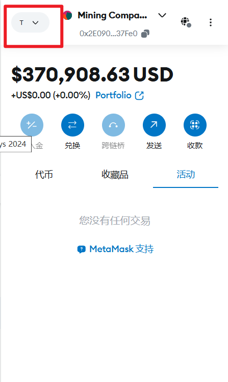
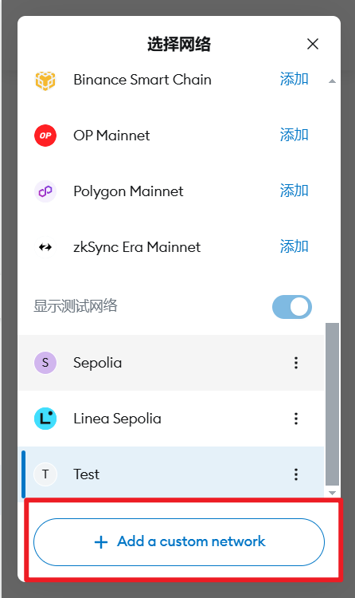
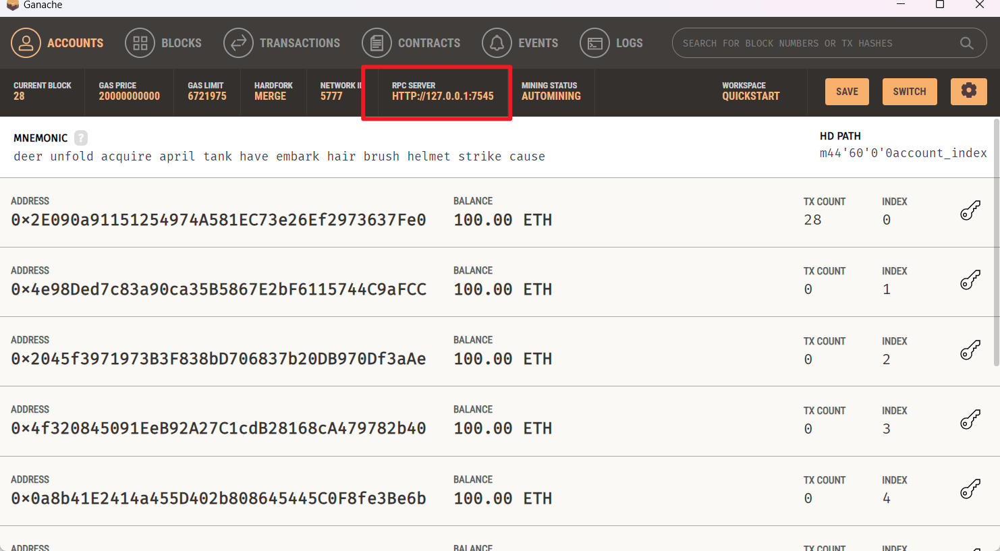
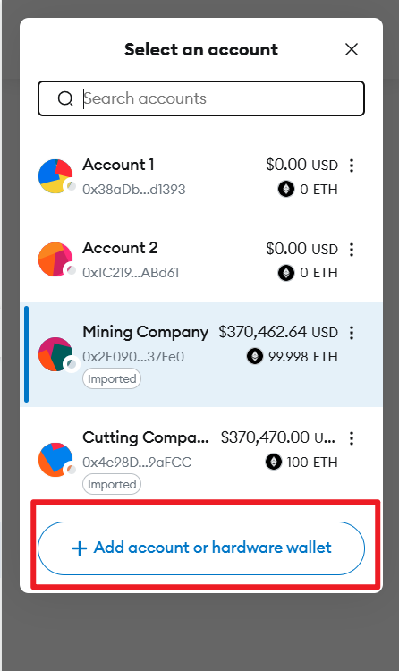
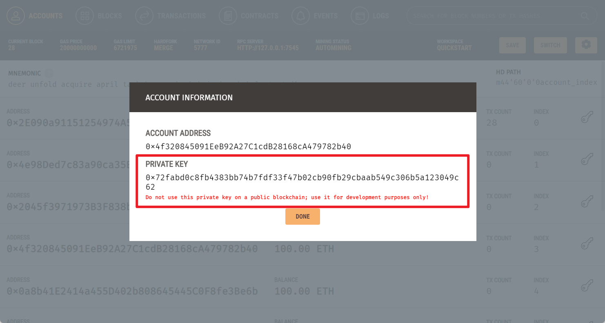
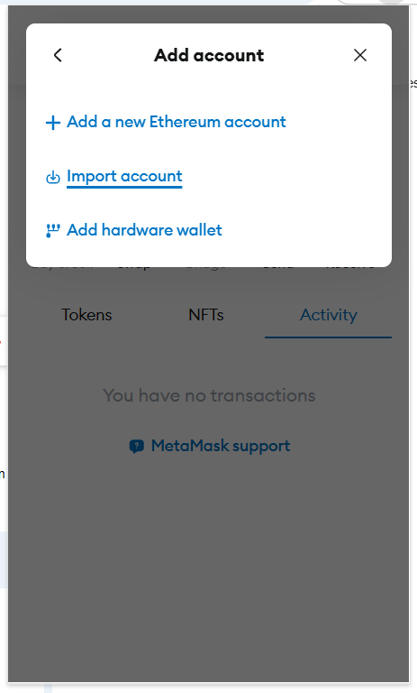
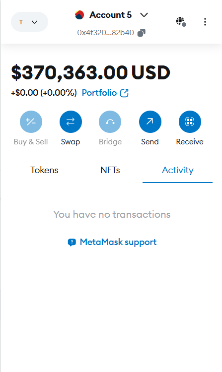

# Project Front-End Installation Guide

## Prerequisites

1. Install dependencies:

```bash
npm install
```

2. Start the development server:

```bash
npm start
```

## MetaMask Configuration Guide

### 1. Add Custom Network


click "Add a custom network"



### 2. Configure Network Settings
- Network Name: Ganache Test
- RPC URL: http://127.0.0.1:7545
- Chain ID: 1337
- Currency Symbol: ETH

Note: You can use check the RPC URL in the Ganache, it is usually http://127.0.0.1:7545, and the Chain ID is 1337



### 3. Import Accounts
Click your account, and then click "Add account or hardware wallet"




### 4. Import Account Using Private Key
- Get the private key from Ganache



- Use it to import the account into MetaMask



### 5. Account Overview
After successful configuration, you should see your account balance and details:



## Important Notes
- Make sure Ganache is running on port 7545
- Use the network ID 1337 for local development
- Never share or commit your private keys
- Only use test accounts for development
